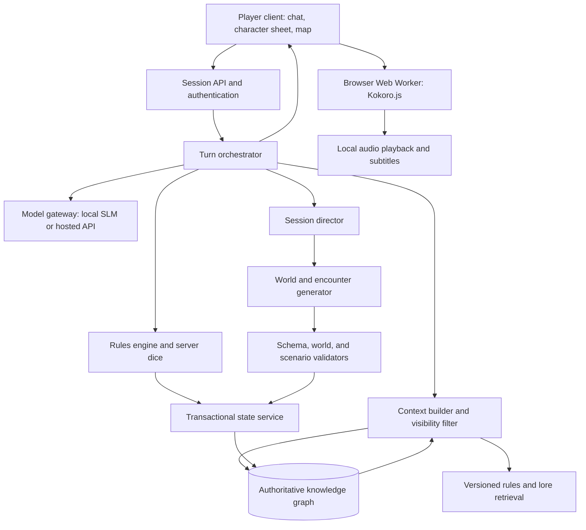

# AI Dungeon Master architecture

## Current local implementation

The initial implementation is named Emberkeep. See README.md for startup, implemented features, and explicit gaps. It uses PostgreSQL 17 in Docker with transactional JSON state, event snapshots, and relational entity/relationship graph tables; Neo4j is not used and Apache AGE is not yet installed. The sections below describe the broader target architecture, including capabilities still planned beyond the first playable slice. The first interface includes the themed character builder, shared four-player lobby, resource HUD, inventory, adventure journal, browser speech integration, and protected AI settings. Shared views currently refresh through HTTP polling rather than WebSockets.

## Scope and assumptions

A text-first cooperative fantasy role-playing game supporting one to four human players per session, a persistent world, and bounded sessions within a campaign. The AI dungeon master does not occupy a player slot. Each player controls one active character initially. Each session has an objective, a time or scene budget, and success, partial-success, and failure endings. Completion means reaching a meaningful resolution, not guaranteeing player victory. Rules are versioned and initially limited to a documented subset of one D&D SRD edition.

The AI can run through a local small language model (SLM), a hosted API, or an explicitly enabled hybrid. Hardware and model quality must be measured before selecting a local model. No cloud fallback occurs when local-only mode is selected. Speech uses browser-embedded Kokoro.js on each player's device, independently of the dungeon master's model provider.

## Core principle

The model proposes; the engine validates and resolves; the graph records; the model narrates the committed result. Generated text is never an authoritative source of HP, inventory, location, quest progress, or dice outcomes.

## Component diagram



Start with a modular monolith plus a database and optional local inference process. These are logical modules, not independent microservices. Serialize mutations per session. Parallelize read-only retrieval and speculative generation where useful.

## Module responsibilities

| Module | Responsibility |
| --- | --- |
| Client | Chat, available actions, character sheet, inventory and equipment, resource HUD, initiative, visible map, session recap |
| Session API | Identity, party membership, command IDs, reconnects, turn streaming |
| Orchestrator | Explicit turn state machine; bounded model calls; retries and recovery |
| Rules engine | Action legality, initiative, movement, checks, saves, combat, conditions, resources, encounter-budget calculations |
| State service | Typed commands, invariant validation, concurrency checks, atomic commits |
| Knowledge graph | Canonical entities, relationships, facts, objectives, and committed events |
| Context builder | Relevant graph neighborhood, exact mechanical state, authorized facts, cited rules, bounded summaries |
| Session director | Objectives, pacing, threats, available story beats, resolution detection |
| World generator | Structured NPCs, locations, factions, dungeon topology, secrets, and encounter candidates |
| Model gateway | Provider adapters, structured-output validation, timeouts, cost limits, capability profiles |

AI roles such as planner, NPC dialogue writer, and narrator are separate prompts or functions using the same gateway. They do not require autonomous agents.

## Player interface, inventory, and resource HUD

The initial playable version includes a persistent personal HUD and an inventory of collected items for each of the one to four players. The server supplies authoritative values; narration never directly changes the display's mechanical state.

Suggested desktop layout: party summary along the top, scene/map and DM narration in the center, personal HUD and quick actions alongside the scene, and inventory in an expandable panel. On smaller screens, keep essential HP and active-turn indicators visible and expose inventory through a dedicated tab. Opening inventory does not pause the shared session.

### Visual direction: fantasy tabletop adventure

The web interface must be D&D-inspired: an adventurer's journal and tabletop campaign brought to the screen. Use original fantasy ornamentation and assets. The design should feel atmospheric while keeping mechanical state, actions, and text easy to read.

- Palette: charcoal stone backgrounds (#191816), warm parchment surfaces (#E8D8B5), near-black ink (#29231C), aged brass accents (#B99A58), and deep burgundy highlights (#792F3B). Use bright text on dark panels and dark ink on parchment; verify actual text/background combinations for contrast before implementation.
- Materials: subtle parchment grain for the journal, restrained leather or wood framing for inventory, and carved-stone framing for the party HUD. Place textures beneath quiet overlays so they never compete with text or resource bars.
- Typography: a decorative fantasy serif for short headings and character names, paired with a highly readable body font and tabular numerals for stats. Avoid decorative fonts in long narration, inventory tables, tooltips, or action buttons.
- Iconography: consistent illustrated or vector icons for swords, shields, potions, backpacks, scrolls, and dice. Pair unfamiliar icons with labels. Preserve one coherent asset style across items and controls.
- Resource styling: crimson HP, blue mana, and green stamina, always accompanied by labels and current/max numbers. Use a separate temporary-HP indicator and clearly labeled status badges. Do not communicate danger or availability through color alone.
- Main scene: a framed environment illustration or map above a parchment campaign journal. Distinguish DM narration, NPC speech, player actions, and mechanical results through speaker labels and consistent typography. Dice results appear as compact structured cards.
- Party HUD: up to four portrait medallions with names, health, conditions, connection status, and an unmistakable active-turn marker. Responsive layouts wrap or collapse summaries without hiding the current player's essential resources.
- Inventory: a satchel-themed panel with item slots or a compact list, category tabs, quantity badges, and visible equipment slots. Selecting an item opens its known description and labeled actions. All drag-and-drop operations also have button-based alternatives.
- Action area: a clearly labeled action bar with familiar fantasy icons, resource costs, and a free-text action field. Disabled actions explain why they are unavailable. Keep primary controls in stable positions during narration and combat.
- Voice controls: integrate a small speaker control into the journal header with visible loading status, subtitles, and accessible playback controls. The visual theme must not obscure voice download progress or failures.
- Motion: brief dice rolls, subtle turn highlights, and restrained resource-change effects. Respect reduced-motion settings; avoid constant particles, flashing damage effects, or animation that delays access to outcomes.
- Accessibility: visible keyboard focus, semantic controls, adequate touch targets, scalable text, and verified WCAG AA contrast. Provide a low-texture presentation option that retains the fantasy palette and layout.

Implement colors, typography, spacing, borders, and resource styles as shared design tokens. Reuse themed components for panels, buttons, item cards, dialogue entries, resource meters, portrait badges, and dialogs so the interface remains consistent across desktop and mobile.

### Resource HUD behavior

- Show current and maximum HP, temporary HP separately, and relevant states such as unconsciousness, death saves, or conditions when the selected rules use them.
- Show mana and stamina when enabled by the ruleset. These are configurable custom resources, not assumed universal D&D mechanics. A ruleset using spell slots instead displays remaining slots by spell level; additional class resources use the same generic resource interface.
- Each ResourceDefinition specifies its ID, label, units, bounds, recovery triggers, and allowed spending rules. CharacterResource stores current value, maximum value, and version. Rules resolve costs, recovery, and maximum-value changes transactionally; the UI only renders them.
- Show initiative position, whether it is the player's turn, and remaining actions, reactions, or movement when applicable. Provide clear feedback when an action lacks the required resource.
- Display both numbers and bars with text labels; do not depend on color alone. Briefly highlight committed changes without obscuring the current value.
- Show connection/pending status and the last synchronized version. A pending command must not appear as a confirmed resource expenditure.

The party strip shows up to four character portraits/names, presence, turn status, and health information allowed by the session's sharing policy. Exact mana, stamina, inventory, and private conditions remain owner-visible by default; party members see only explicitly shared information.

### Inventory and equipment

Each collected item appears with its player-known name, icon or category, quantity, weight when relevant, and known description. Show equipment slots, equipped state, charges, and attunement only when supported by the ruleset. Hidden curses, unidentified properties, and secret item identities are excluded from client payloads.

Provide search and filters for weapons, armor, consumables, quest items, and miscellaneous items. Support inspect, equip/unequip, use, split stack, drop, and offer transfer through typed server commands. Show action costs and target requirements before submission. Collected-item notifications and inventory history derive from committed events.

ItemDefinition contains shared template data; ItemInstance stores unique identity, owner or world container, quantity, condition, and mutable properties. Stack only items with matching stack-relevant properties; individually enchanted or differently charged items remain distinct. Model containers explicitly and reject cyclic containment. Capacity and encumbrance are enforced only when enabled by the ruleset.

Transfers require the recipient's acceptance and a final atomic check of ownership, quantity, location/access, and capacity. An offer does not transfer ownership; if the item was consumed or moved meanwhile, acceptance fails cleanly. Two players attempting to collect the same item cannot both receive it. Shared loot is a world container with authorized access, not a duplicated copy in every inventory.

Suggested commands: collect_item, equip_item, unequip_item, use_item, split_stack, drop_item, offer_item_transfer, accept_item_transfer. Every command includes a unique command ID, actor ID, and expected state version. The server derives the authenticated player and validates their control of the actor.

### Synchronization contract

On join/reconnect, return an authorized PlayerView containing personal resources, visible conditions, inventory, equipment, party summary, current action window, and synchronization cursor. After a commit, publish audience-filtered deltas such as ResourceChanged, ItemCollected, ItemConsumed, ItemEquipped, and ItemTransferred. Apply each delivery once; request a fresh snapshot when a delivery gap is detected. A consumable that restores HP updates inventory and resources atomically and is delivered as one committed change batch.

The UI uses structured state for all quantities and item actions. The AI may describe a found potion, but it appears in inventory only after a valid collection event. Refreshing the page or changing model providers must preserve the same HUD and inventory.

## Admin route and AI configuration

Provide a protected /admin route with /admin/ai for configuring the dungeon master and browser speech. Use the same fantasy visual language with a restrained, readable settings layout. Administrative privileges are separate from session-host privileges: hosting a party does not grant access to infrastructure settings or API credentials.

### Settings interface

- Provider connections: add, label, edit, disable, and remove hosted API connections; add or rotate API keys through a masked input. After saving, show only configured status and a safe identifier, never the saved secret. Replacing a key requires a new value; an unchanged masked placeholder must not overwrite it.
- Local inference: configure approved SLM endpoints, connection authentication where required, model identifiers, and connection timeouts. Local endpoints refer to the game server's network environment, not the player's browser.
- Model selection: choose local-only, hosted API, or explicitly enabled hybrid mode. Select a provider/model per task (action interpretation, world generation, session planning, NPC dialogue, narration), with a simple default model plus optional per-task overrides. List provider models when supported and allow a validated explicit model ID otherwise.
- Generation controls: configure supported context/output limits, temperature, bounded retries, request timeouts, concurrency, and per-session token/cost budgets. Hide or disable unsupported parameters based on the adapter's capability profile. Treat cost as estimated unless reconciled with provider usage.
- Fallbacks: explicitly configure permitted provider/model fallback order. Local-only mode forbids cloud calls. Exhausted budgets, missing credentials, and failed connections use the defined deterministic/text fallback or pause the affected AI operation without corrupting state.
- Speech: configure the approved browser model revision, default DM voice, NPC preset pool, default speed, and tested WASM/WebGPU choices. Browser TTS requires no speech-provider API key. Personal mute, volume, and playback choices remain per-player controls.
- Validation and status: offer Save Draft, Test Connection, Validate Configuration, and Activate actions. Connection tests send a minimal synthetic request and clearly indicate that an inference test may use provider credits. Display sanitized errors, supported capabilities, and last successful test time.

### Server-side security and configuration lifecycle

Protect both page access and every /api/admin endpoint with authenticated, server-enforced admin authorization. Bootstrap the first administrator through deployment configuration or a one-time setup mechanism that closes after initialization. Do not ship default admin credentials. Apply CSRF protection when using cookie authentication and rate-limit login and credential-management endpoints.

API keys travel over HTTPS to the backend and remain in a server-side secret store, or encrypted at rest with the encryption key held outside the application database. AIConfig stores secret references rather than plaintext credentials. Never include secrets in browser bundles, localStorage, WebSocket payloads, model prompts, logs, exports, audit diffs, or configuration read responses. Redact provider exceptions before displaying them. Only backend provider adapters retrieve credentials for inference calls.

Use typed provider adapters and approved endpoint policies. Validate schemes, hosts, ports, and redirects before server-side connection tests or model discovery. Hosted providers use approved HTTPS endpoints; deployments explicitly allow the loopback/private endpoints needed for local SLMs. Block cloud metadata endpoints and unintended destinations. Browser speech assets use approved static sources rather than arbitrary executable URLs from settings.

Model configuration is versioned: draft → validated → active → retired. Validate required credentials, adapter/model capabilities, limits, and allowed fallbacks before activation. Record who changed which non-secret settings, when, and which version was activated. Record credential changes without their values. Allow rollback to an earlier valid configuration version; credential rollback is separate and cannot restore a revoked key.

Pin each session to an AI configuration version at creation. Apply ordinary model/prompt changes to new sessions by default, with an explicit safe-boundary migration for existing sessions. Credential rotation updates the underlying secret reference for subsequent calls; urgent provider disablement or key revocation overrides session pinning. In-flight requests may complete or fail and must preserve normal command idempotency and recovery behavior.

Suggested persistence: AIConfigVersion, ProviderConnection, ModelTaskProfile, SpeechConfig, and AdminAuditEvent. Suggested endpoints: GET /api/admin/ai, POST /api/admin/providers, POST /api/admin/providers/{id}/test, PUT /api/admin/ai/draft, POST /api/admin/ai/validate, and POST /api/admin/ai/activate. Secret writes are write-only; reads return redacted metadata. Player-facing configuration endpoints expose only approved public speech settings and other information needed by the UI.

## Browser-embedded text-to-speech

Selected implementation: Kokoro.js with the Kokoro-82M v1.0 ONNX model, executed on each player's device in a dedicated Web Worker. No server-side TTS inference is required. The dungeon master's SLM/API generates text; this separate speech model converts approved narration into audio.

### Loading and runtime

- Voice is opt-in through an Enable Voice control that initializes browser audio playback. Keep text immediately available while the model loads.
- Start with the documented quantized q8 WebAssembly configuration. Offer WebGPU only after successful capability detection, initialization, and target-device testing, using a supported precision configuration. If GPU initialization fails, attempt the tested WASM configuration; if local synthesis fails, retain text-only play.
- Pin the library version, model revision, runtime assets, and voice assets together. Serve these static assets from the application's deployment and configure their URLs explicitly. Cache versioned assets locally where browser storage permits; show download progress and retry controls. Cache eviction may require a later download.
- Load one speech worker/model instance per client, reuse it across utterances, and bound its queue and memory usage. Release resources when voice is disabled. Model download size and runtime memory are separate measurements to record before release.
- Keep inference off the UI thread so inventory, HUD, and player input remain responsive. Benchmark on target desktop and mobile devices; do not promise real-time synthesis on all hardware.

### Narration and voice contract

The server sends an authorized narration envelope containing narration_id, committed event reference, scene_id, ordered segment IDs, speaker_id, voice_id, text, and final/completion status. Only text describing committed outcomes is eligible for speech. Filter its audience before delivery; hidden facts must never enter a player's speech worker.

Persist a voice profile for the DM and each voiced NPC, including a supported preset voice ID and bounded speaking speed. Use a default narrator voice when a selected voice is unavailable. Voice assignments persist across saves and model-provider changes. Voice profiles select presets; voice cloning is outside the initial scope.

Send complete, stable sentences into the speech queue as narration becomes available. Do not synthesize partial tokens that may be revised. Tag each generated audio chunk with its narration and segment IDs, preserve playback order, and discard duplicate deliveries. Subtitles use the same segment text; word-level synchronization is not required initially.

### Playback and four-player behavior

- Each client synthesizes only its authorized text. Shared narration is delivered to the party, while private or split-scene dialogue reaches only the relevant players.
- Provide enable/disable voice, volume, pause/resume, skip narration, replay, and speed controls alongside persistent subtitles.
- Local playback is independent: slower synthesis or muted audio cannot block another player or a game-state commit. Game decisions use explicit action windows, not audio-completion events. Exact synchronized playback across devices is outside the initial scope.
- Skip, scene changes, and disabling voice invalidate queued playback. Ignore late worker results using a playback-generation token; stop or restart a worker when needed to cancel expensive outstanding generation.
- Reconnect restores text history and current state without automatically speaking the entire backlog. Replay is explicit. Keep any audio cache bounded, scoped to the authenticated player/session, and clear it on logout or session departure.
- TTS failure never loses a turn or changes game state. Surface a concise voice-status message and continue with text. No automatic cloud speech fallback.

The deployment still needs a game server for authoritative multiplayer state and a local/API DM model. Browser speech eliminates the TTS inference service, not these other components. Initial asset downloads require connectivity; cached speech assets can support local synthesis afterward, subject to browser cache availability.

## Required pre-session character building

Every player must complete character creation before entering gameplay. An invitation opens a staging lobby and character builder; a staging membership reserves a seat but does not grant entry to the active session. Support one to four players, with one completed active character per player.

Interpret the four random classes as one shared pool generated for the session, not four separate choices per player. Generate the pool once and persist it before players choose. All four options must have distinct mechanical archetypes, not merely different names. No two active or reserved characters in the session may hold the same class; the fourth player selects the remaining class. Sessions with fewer players may leave classes unused.

### Builder flow and themed UI

Use a parchment character folio with a visible stepper: Choose Class → Starter Items → Character Points → Skill Points → Review and Ready. Show remaining budgets, reserved class, and a live character preview throughout. Players may return to earlier steps before finalization; invalidate dependent choices when their prerequisites change.

1. Choose class: display four generated class cards showing theme, party role, primary attributes, starting resources, permitted equipment, signature abilities, and available skills. Mark each card Available, Reserved by you, Reserved by another player, or Taken. Make the last remaining option explicit without skipping the player's review. A successful server reservation advances the builder.
2. Select starter items: present class-appropriate equipment bundles or a finite catalog with a defined starting allowance, required choices, and quantity limits. Show selected items and remaining allowance. Starter items remain draft selections until finalization and cannot be traded or consumed from the builder.
3. Allocate character points: spend a configured budget on base attributes. Display minimum/maximum values, point costs, refunds, and resulting derived values. Use the selected ruleset's attribute schema and cost table; do not hardcode a budget before balancing it. HP, mana, stamina, and other derived statistics are previews calculated by engine formulas, not independently editable values unless the rules explicitly permit that.
4. Allocate skill points: spend a separate configured budget on eligible skills. Show rank costs, caps, prerequisites, and any class-granted ranks separately. Validate allocations against class and attribute choices. Skill ranks and their effects are explicit custom mechanics when using this progression system; do not silently treat them as standard D&D proficiency rules.
5. Review and Ready: show class, attributes, skills, starter inventory, equipment, and derived resources. Require a valid, complete build with all required choices and both budgets fully allocated under the configured rules. Finalization locks the initial build and marks the player ready. The host may start with one to four ready players; no player with an incomplete build enters gameplay.

### Safe random class generation

Generate classes by constrained composition from approved archetypes, ability definitions, resource formulas, skill lists, and equipment permissions. The AI supplies class names, descriptions, and flavor; it does not invent executable rules or unbounded bonuses. Treat the generated classes as a custom rules module with a pinned version.

Store class_id, archetype_key, generation seed, generator/ruleset versions, ability references, attribute guidance, resource definitions, starting-item policy, and skill eligibility. Validate that each option admits at least one legal complete build, has a usable starting loadout, and stays within the configured power budget. Test pool diversity and solo-to-four-player encounter compatibility. Do not make session objectives depend on a particular class being selected.

Reject invalid pools with bounded regeneration attempts and fall back to a curated four-class pool. Opening or refreshing the builder must never reroll classes. Once any class is reserved, the pool remains fixed for that session.

### Reservations, persistence, and finalization

Model ClassPool, ClassOption, CharacterDraft, ClassReservation, and versioned BuildRules in persistence. Drafts record player membership, selected class, item selections, attribute allocation, skill allocation, and draft version. Budget totals and derived stats are computed server-side rather than trusted from client submissions.

Reserve classes transactionally within the session: at most one live reservation/finalized holder per class and at most one selected class per staging membership. Concurrent attempts yield one winner and a clear unavailable response to the other player. Class switching atomically acquires the new class and releases the old one; if acquisition fails, retain the original reservation. Reset or revalidate dependent item and point selections after a successful switch.

Persist draft progress and class ownership across refreshes and disconnects. A disconnect does not automatically release the class. Before gameplay starts, leaving the lobby or explicit host removal releases the seat and class reservation. A finalized character still active in the world retains its class allocation even when its player disconnects; release it only through an explicit retirement/removal transition at a safe boundary.

Finalize with a unique command ID and expected draft version. In one transaction, revalidate class ownership, rule versions, both point budgets, prerequisites, and starter selections; create the character, skill/resource state, and starter item instances; convert the reservation to a finalized class allocation; and mark membership ready. Duplicate finalization returns the existing character and must not mint extra items. Failed finalization leaves the draft intact with field-level errors.

Late joining uses the same builder and only unallocated classes and available seats. Admit a completed late join at a safe scene boundary. Character respecs, replacements, and class changes after admission are outside the initial builder flow and require separate game rules.

Suggested commands: reserve_class, update_character_draft, switch_reserved_class, finalize_character, leave_staging_lobby. Broadcast class availability changes to staging clients without exposing another player's private allocations. Include all builder endpoints in membership, ownership, version, and idempotency validation.

## Multiplayer session model

Four-player support is part of the initial playable version. One authoritative session orchestrator and one shared world serve all four clients; each client receives a view filtered for that player.

- Lobby: invite-based staging membership with a transactional limit of four occupied seats. Character building is mandatory before gameplay admission. Disconnected players retain their seat and reserved class until an explicit release transition. Rejoining restores the same draft or character. Simultaneous joins cannot exceed capacity.
- Identity and control: model Player and SessionMembership separately from Character, with membership role, seat, and controlled character. Validate command ownership on the server. The host manages invitations and pause/resume, without automatically gaining control over other characters or access to their secrets.
- Exploration: accept free-form intentions from all players. Resolve consequential actions through the session queue, revalidating against the latest state. Use short decision windows for coordinated actions such as group travel; require affected players to confirm moving their characters. Chat does not advance game time automatically.
- Combat: enforce initiative, action economy, and explicit reaction windows. Queue out-of-turn intentions without executing them early. Persist pending choices so reconnects do not lose a turn. Default to pausing for a disconnected player's required decision; any delegated control must be explicitly configured.
- Shared and private information: broadcast public scene narration only to its authorized audience. Send private discoveries through separate player channels. Sharing a fact is an explicit character action. If the party splits, track locations and scene audiences separately while retaining one authoritative session clock and event ordering.
- Fair participation: the director tracks recent meaningful contributions and offers quieter players opportunities to act. Group votes inform party decisions but cannot force another character's action or reveal private information.
- Encounter generation: calculate budgets using the participating characters' count, levels, abilities, and resources. Support parties of one, two, three, or four; a network disconnect does not remove a character from the encounter. Reassess future encounters after roster changes at safe scene boundaries.
- Transport and recovery: accept commands over authenticated HTTP and broadcast state, presence, action windows, and narration over authenticated WebSockets. Use per-recipient delivery cursors, acknowledgements, and authorized snapshots on reconnect. Persist audience permissions for historical messages and recheck membership before replaying them. Clients never receive the complete graph or hidden event payloads.
- Inference: share public narration across its audience and generate private responses only when necessary. Bound the session's model queue so four simultaneous submissions cannot create competing world updates. If inference is unavailable, preserve pending choices and committed state.

## Persistence and knowledge graph

Use Neo4j as the initial canonical store for both current state and application events, committing them in one transaction. Its transactional interface supports atomic updates. Keep rules documents and static content in versioned files initially; add an object store for images or audio when needed. A vector index is optional for semantic lore retrieval and must never replace exact graph lookups for mechanics.

Primary nodes:

- Campaign, Session, Party, Player, SessionMembership, Character, NPC, Faction.
- ClassPool, ClassOption, CharacterDraft, ClassReservation, BuildRules.
- Region, Location, Dungeon, Room, Passage.
- ItemInstance, ItemDefinition, Container, ResourceDefinition, CharacterResource, CreatureDefinition, RuleDefinition.
- Objective, StoryBeat, Encounter, ThreatClock.
- Fact, Event, Turn, GenerationProposal.

Representative relationships:

```text
(Player)-[:HAS_MEMBERSHIP]->(SessionMembership)
(SessionMembership)-[:IN_SESSION]->(Session)
(SessionMembership)-[:CONTROLS]->(Character)
(Character)-[:MEMBER_OF]->(Party)
(Character)-[:LOCATED_IN]->(Room)
(Room)-[:PART_OF]->(Dungeon)
(Passage)-[:FROM]->(Room)
(Passage)-[:TO]->(Room)
(NPC)-[:MEMBER_OF]->(Faction)
(Character)-[:OWNS]->(ItemInstance)
(Character)-[:KNOWS]->(Fact)
(Fact)-[:ABOUT]->(NPC | Location | Objective)
(Objective)-[:REQUIRES]->(Objective)
(StoryBeat)-[:ADVANCES]->(Objective)
(Encounter)-[:OCCURS_IN]->(Location)
(Event)-[:AFFECTS]->(Entity)
```

Passages are entities so doors, directionality, traps, locks, and travel costs have an explicit home. Facts represent claims separately from world truth: an NPC can believe a false rumor without changing canonical history. Track provenance, truth status, visibility scope, and effective time. Relationships that need independent history or access rules should also become nodes.

Every mutable entity has a stable ID, campaign ID, version, and creation metadata. Every event records session ID, sequence, command ID, actor, ruleset version, event schema version, resolved changes, and dice results. Scope every query by campaign/session and authorize it through the state service.

State invariants include one current location per character, at most one owner per item instance, valid referenced entities, bounded resource values under the selected rules, and legal objective transitions. Enforce database uniqueness constraints plus transactional application checks.

Write current graph changes, the event, and the command result together. A duplicate command ID returns its existing result. A stale expected version triggers revalidation. Never retry dice independently after a committed command. Snapshots plus stored event deltas support restoration without rerunning the model or rerolling dice. Undo creates an explicit branch or compensating event.

## Turn execution

1. Authenticate the player and accept a command with a unique ID and expected session version.
2. Build a bounded context containing exact actor state, nearby entities, known facts, active threats, and relevant rules.
3. Ask the model to translate free text into a typed action proposal. Ask an in-game clarification if a material ambiguity cannot be resolved.
4. Validate targets, action economy, ownership, distance, resources, and rule support. The model cannot submit arbitrary graph queries or executable code.
5. Resolve the action with deterministic rules and server-controlled dice. For improvised actions, use an explicit adjudication policy with bounded difficulty choices; record the ruling.
6. Atomically commit outcomes and events against the expected state version.
7. Evaluate objective predicates and threat clocks. If necessary, select and validate the next beat before committing it.
8. Narrate committed outcomes using only player-visible information. Render rolls, damage, item transfers, and objective changes from structured results in the UI.
9. Return the new version and persist the response. If narration fails, show a deterministic outcome summary; do not reverse or repeat the action.

Suggested turn states: RECEIVED, INTERPRETED, VALIDATED, RESOLVED, COMMITTED, NARRATED, FAILED. Recovery resumes from the last durable boundary. Player action windows and initiative rules determine who may act; a session mutation queue handles concurrent submissions.

Example action proposal:

```json
{
  "type": "attempt_action",
  "actor_id": "pc_01",
  "action": "pick_lock",
  "target_id": "door_17",
  "approach": "Use thieves tools quietly",
  "expected_session_version": 42
}
```

The model does not provide a successful roll, a new inventory, or a state patch. It selects from a bounded action schema. Unsupported rules receive an explicit limitation or a recorded adjudication, rather than fabricated mechanics.

## World generation

Generate hierarchically: campaign premise and constraints → region and factions → session area → locations and dungeon topology → inhabitants, clues, encounters, and descriptive detail.

Generate only the starting area and key dependencies upfront. Expand unexplored areas on demand, while preserving all established facts. Separate proposed content from committed world state; speculative generation must not mutate canon.

NPC records include goals, fears, faction, relationships, disposition, known facts, dialogue style, and a reference to an approved stat block. Environment records include terrain, hazards, resources, travel links, and sensory descriptions. Dungeon records include rooms, passages, traversal requirements, encounter sites, treasure, and exits.

Code creates and validates topology, placement, and budgets; the model supplies coherent motives, themes, and prose. Validate connectivity, access to critical objectives, keys reachable before mandatory locks, schema conformance, allowed content references, and consistency with existing facts. Reject and regenerate invalid candidates with bounded retries, then use curated templates.

Seed procedural choices for reproducibility. Record accepted model outputs, generator versions, and seeds: a seed alone does not make model text reproducible.

## Scenarios, encounters, and session completion

Represent a session as an objective graph and a pool of possible beats rather than a fixed script. Store an objective's success/partial/failure predicates in a small validated expression language evaluated by code. Keep the ending condition separate from particular encounters.

Example session: stop a ritual threatening a village. Success can follow defeating the leader, disabling the altar, or persuading the faction to withdraw. Partial success might evacuate the village while the ritual proceeds. Failure may occur when the threat clock expires. A separate pause state supports resuming an unfinished session.

Each beat or encounter template declares:

- Preconditions and valid locations.
- Links to objectives, factions, or player goals.
- Participants and approved mechanical definitions.
- Difficulty/resource budget, expected duration, and encounter type.
- Possible outcomes, clues, objective effects, and clock effects.
- Cooldown/repetition limits and whether it is optional.

The director first filters candidates by hard constraints: canonical state, party capability, geography, prerequisite access, and content preferences. It then samples from weighted candidates using objective relevance, pacing fit, faction plausibility, novelty, and party condition. Record weights and the selected seed for diagnosis.

Randomness selects among coherent possibilities. A patrol may carry information, an NPC may offer a route, or a hazard may reveal an old entrance. Also allow quiet exploration and optional discoveries; every encounter need not advance the main objective.

Track tension, recent combat frequency, remaining session budget, open objectives, and the threat clock. Early beats introduce stakes; middle beats reveal choices and consequences; later beats make resolution opportunities available. These are pacing preferences, not mandatory acts. Shorter sessions reduce optional beats and make existing clues easier to discover without moving established locations or overriding player choices.

Maintain multiple routes to critical information. Failed checks can impose costs, danger, or delay while preserving alternative routes. Validate static dependency reachability, then re-evaluate available paths after player actions. If the players eliminate all success paths, expose consequences and resolve the appropriate ending; do not silently restore dead NPCs or invent guaranteed victory.

## Context and model strategy

Build context in priority order: engine instructions and schemas, committed mechanical state, visible local graph neighborhood, current action, relevant rules, recent events, then campaign summary. Enforce a token budget. Summaries are disposable caches with event ranges and source references; rebuild them when invalidated.

Use separate access views for the director, individual NPCs, and player narration. NPC context contains only what that NPC can know. Player narration excludes hidden traps, unrevealed identities, private character facts, and GM-only plans. Lore and player input are untrusted content and cannot redefine tool permissions.

Local SLM mode uses short contexts, small schemas, narrow tasks, curated templates, and bounded repair attempts. Hosted API mode uses the same interfaces and validators. Hybrid mode can route more demanding planning or narration to an API if enabled. Structured-output support is a provider capability, not an assumption; validate every response regardless.

Suggested gateway methods: interpretAction, proposeWorldContent, proposeBeat, writeNpcDialogue, narrateOutcome. Use independent temperature and token limits per method. Measure schema validity, state contradictions, secret leakage, latency, and cost before selecting a model. Keep a deterministic fallback for every critical path.

## Suggested implementation stack

- Browser client using TypeScript and React.
- Python application with FastAPI and typed schemas, organized as a modular monolith.
- Neo4j for canonical graph state and transactional game events.
- Versioned JSON/YAML rule definitions and encounter templates in source control.
- Model adapters for a chosen hosted API and llama.cpp server for local inference.
- Browser speech: Kokoro.js, pinned Kokoro-82M v1.0 ONNX assets, a dedicated Web Worker, and local browser audio playback. Quantized WASM is the baseline; WebGPU is an optional tested acceleration path.
- Authenticated HTTP commands and WebSockets for shared state, presence, action windows, and audience-filtered narration from the initial version.

This is a starting recommendation, not a requirement. Size each session for up to four players. Local hardware, deployment target, and expected concurrent sessions remain sizing inputs. Keep game mechanics and domain commands independent of transport, database query syntax, and model provider SDKs.

## Delivery sequence

1. Build a playable vertical slice for one to four players: staging lobby, four generated exclusive class options, required character builder with starter items and separate character/skill point allocation, character ownership, synchronized state, personal resource HUD, collected-item inventory and equipment, private messages, initiative and reconnects, one village, one small dungeon, a handful of NPCs, one objective with multiple endings, action validation, dice, graph persistence, and save/resume.
2. Add structured generation, dungeon validation, NPC knowledge, and a director selecting from curated encounter templates.
3. Add dynamic world expansion, broader rule coverage, campaign consequences, and measured SLM/API compatibility.
4. Integrate the selected browser-embedded speech module after multiplayer state correctness and session completion are reliable; then add richer maps and media. Speech recognition and player voice chat remain separate future features.

## Acceptance criteria

- Non-admin users, including session hosts, cannot access admin pages or settings APIs; direct API requests enforce the same restriction.
- Admins can add/rotate a provider key, test a connection, select task models, and activate a validated configuration without editing source files.
- Saved keys never appear in read responses, browser storage, logs, exports, or player payloads; connection-test failures are sanitized.
- Invalid endpoints, unsupported model settings, and missing credentials cannot activate; local-only sessions never fall back to hosted inference.
- Active sessions retain their configuration version until an explicit migration, while provider disablement and secret rotation affect subsequent calls as specified.
- A player cannot enter gameplay until character building is finalized; one to four completed players can start a session.
- The session exposes exactly four validated distinct class options, stable across refreshes; simultaneous selections cannot produce duplicate class holders.
- All four players can complete builds from the shared class pool, including the last remaining option; every option admits a valid allocation and loadout.
- Character and skill budgets, rank caps, prerequisites, and starter-item limits reject invalid client submissions without changing authoritative state.
- Draft progress and class reservations survive reconnects; class switches cannot lose the old reservation when the new class is unavailable.
- Finalization creates starter items and the character exactly once, including retries; leaving staging releases the class while disconnecting does not.
- Desktop and mobile views consistently apply the fantasy tabletop theme to the journal, party HUD, inventory, action controls, and voice controls.
- The themed UI passes keyboard navigation, text scaling, contrast, and reduced-motion checks; decorative assets do not obscure resource values, item counts, or action labels.
- Browser speech generates DM narration and assigned NPC voices without sending text to a TTS inference server; pinned static model/runtime assets are the only speech-related downloads.
- The HUD and inventory remain responsive during model loading and synthesis on the supported device matrix; measure first-audio latency, sustained generation speed, and peak memory.
- Voice enablement, loading failure, unavailable WebGPU, cache eviction, mute, skip, and text-only fallback work without blocking gameplay.
- Four clients can play with different voice settings and playback speeds; private narration never reaches unauthorized clients or their speech workers.
- Duplicate/reconnected narration does not replay automatically; scene changes and skip commands prevent late audio from playing.
- HUD values and inventory match committed state after collection, equipment changes, resource spending/recovery, item consumption, refresh, and reconnect.
- Consuming a healing item decrements inventory and restores HP exactly once as one atomic update, including duplicate submissions.
- Transfers require acceptance; stale offers and concurrent loot claims cannot duplicate items or quantities.
- Disabled resources are absent from the HUD; enabled mana/stamina or spell-slot resources follow the selected ruleset's recovery and spending rules.
- Item payloads exclude unidentified properties and private inventory data from unauthorized players.
- One-, two-, three-, and four-player sessions complete the vertical slice; a fifth membership is rejected even under concurrent joins.
- Four simultaneous commands preserve state consistency and character ownership; unauthorized and out-of-turn actions cannot execute.
- Disconnect/reconnect restores the character, authorized history, and pending choices without repeating committed actions.
- Public state converges across four connected clients; private messages and split-party discoveries reach only their authorized recipients, including during replay.
- Encounter selection uses actual participating character counts and does not change because of transient disconnections.
- Replaying saved event deltas restores identical mechanical state.
- Duplicate requests cannot consume resources or roll twice.
- Concurrent actions cannot acquire the same unique item.
- Invalid model outputs cannot mutate the graph.
- The player context excludes all GM-only facts; NPCs do not receive others' private knowledge.
- Generated test dungeons satisfy declared traversal and objective dependencies.
- Scripted playthroughs demonstrate success, partial success, failure, and pause/resume.
- Director simulations detect repeated encounters, inaccessible mandatory clues, and missing terminal states.
- Provider outages after a commit preserve the outcome and return fallback narration.
- Trace records connect each turn to context source IDs, model/version, validation results, dice, events, latency, and cost.

## References

- Kokoro.js browser WASM/WebGPU configuration and streaming: https://github.com/hexgrad/kokoro/tree/main/kokoro.js
- Browser model assets: https://huggingface.co/onnx-community/Kokoro-82M-v1.0-ONNX
- Neo4j transaction semantics: https://neo4j.com/docs/operations-manual/current/database-internals/transaction-management/
- llama.cpp server and tool calling configuration: https://github.com/ggml-org/llama.cpp/blob/master/tools/server/README.md
- Official SRD versions and content licensing information: https://www.dndbeyond.com/srd

Select one SRD version explicitly and preserve source/attribution metadata for its content. Do not silently mix rule editions. The official SRD page documents which rules content is offered under Creative Commons.
